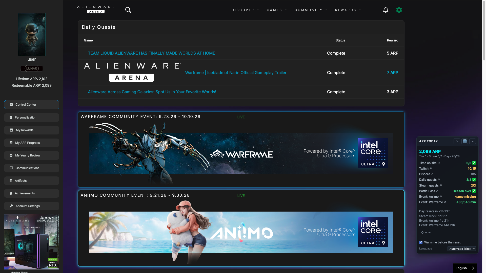
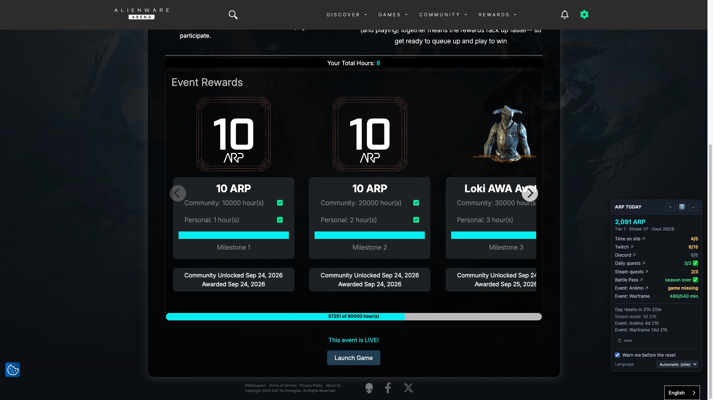
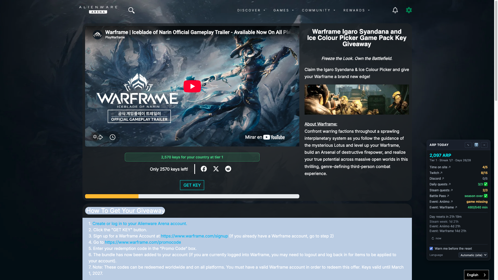
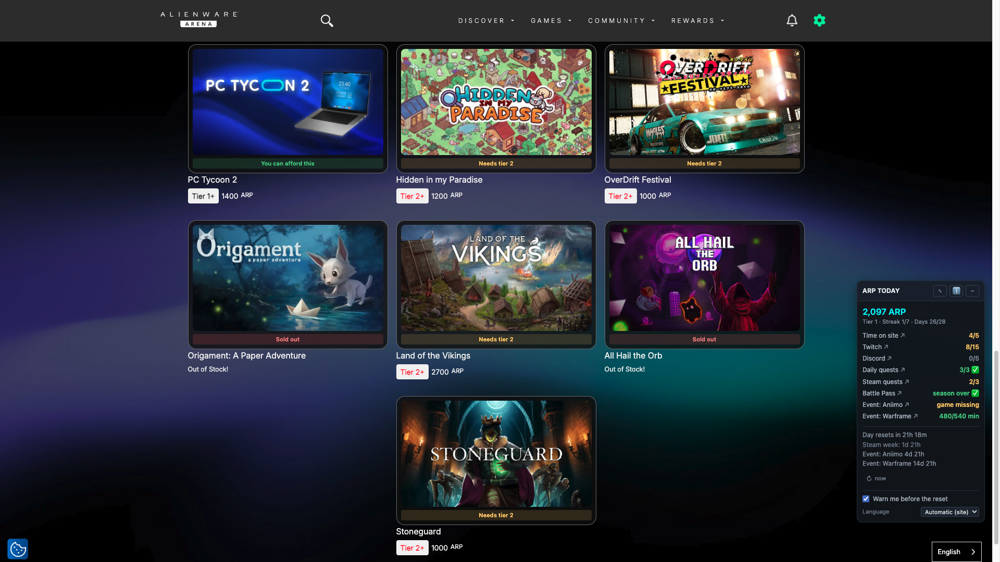
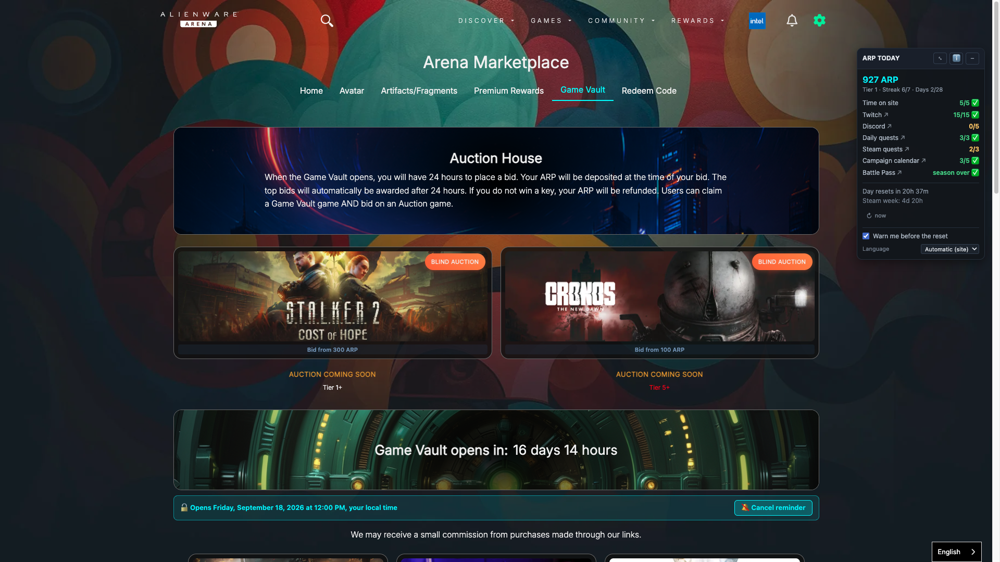

# Alienware Arena ARP Tracker

Userscript that shows, on every Alienware Arena page, what ARP you still have to earn today and when it expires. / Userscript que muestra, en cualquier página de Alienware Arena, qué ARP te queda por ganar hoy y cuándo caduca.

**⚡ Quick install / Instalación rápida:** **[Install / Instalar](https://github.com/g31w0fw0rld/alienware-arena-arp-tracker/raw/main/alienware-arena-arp-tracker.user.js)** — also on / también en [GreasyFork](https://greasyfork.org/scripts/593526) · [OpenUserJS](https://openuserjs.org/scripts/g31w0fw0rldgmail.com/Alienware_Arena_ARP_Tracker).

> You need a userscript manager first: [Violentmonkey](https://violentmonkey.github.io/) (open source) or [Tampermonkey](https://www.tampermonkey.net/). On Chrome and Edge, also turn on **Allow user scripts** on the extension's own page in `chrome://extensions` — without it nothing runs. Step-by-step under [English](#english).
>
> Necesitas antes un gestor de userscripts: [Violentmonkey](https://violentmonkey.github.io/) (código abierto) o [Tampermonkey](https://www.tampermonkey.net/). En Chrome y Edge, activa además **Allow user scripts** en la página de la propia extensión en `chrome://extensions`; sin eso no se ejecuta nada. Pasos detallados en [Español](#español).

*The panel, on any page. Each line is `done/total`, green with a tick when it is finished, amber while it is not, and the ↗ marks the ones you complete somewhere else. / El panel, en cualquier página. Cada línea es `hechas/total`, en verde con marca cuando está cumplida, en ámbar mientras no, y la ↗ señala las que se cumplen en otro sitio.*

*A finished Steam community event. Each milestone needs two things at once —the community reaching a total of hours and you reaching your own— so the panel only says «all milestones» when both are met; until then it counts your minutes towards the next one, and it warns you when you have not joined, because playtime from before you join is thrown away. / Un evento comunitario de Steam, terminado. Cada hito exige dos cosas a la vez —que la comunidad llegue a un total de horas y que llegues tú a las tuyas—, así que el panel solo dice «todos los hitos» cuando se cumplen ambas; hasta entonces cuenta tus minutos hacia el siguiente, y avisa cuando no te has unido, porque el tiempo jugado antes de unirte se tira.*

*On a giveaway page, above the button: read from the giveaway's own per-country, per-tier stock before you click anything. / En la ficha de un sorteo, encima del botón: leído del inventario por país y por nivel del propio sorteo antes de pulsar nada.*

*In the Marketplace and the Vault, one tag per card, from the price, stock and tier the card itself carries. / En el Marketplace y la Bóveda, una etiqueta por tarjeta, del precio, el stock y el nivel que trae la propia tarjeta.*

*The Vault before it opens: each auction shows its minimum bid instead of «auction over», and under the site's own countdown, the exact opening time in your clock — with the bell already armed. / La Bóveda antes de abrir: cada subasta enseña su puja mínima en vez de «subasta terminada», y bajo la cuenta atrás del propio sitio, la hora exacta de apertura en tu reloj — con la campana ya armada.*

## English

### What it does

It changes **four** places. Nothing else on the site is touched.

**1. On any page — the panel.** Your balance, your tier and the two login counts, then one line per source of daily ARP:

- **Time on site** and **Twitch**, which reset at 00:00 UTC. When Twitch is at zero the panel says why: watching alone earns nothing, the AWA widget has to be active on a Hive or Nexus channel with your Twitch account linked. Some artifacts raise the daily cap above 15; the extra arrives separately once the 15 are in, so until then the line reads «15/15+» and its tooltip explains why.
- **Discord**, the only source with no counter anywhere on the site — it is read from your own ARP log, filtered to today. It only pays **Monday to Friday**, so at the weekend the line stops asking for it. Clicking it opens the **Arena Connect** channel of Alienware's Discord in a new tab — the one where the polls are voted.
- **Daily quests**, which are single use: when the window closes they are gone, done or not.
- **Steam quests**, which run **Monday to Monday**, not daily. When there are two and the game of the fixed one also appears in the picker of the one that lets you choose, picking it makes the same hour count for both — the panel says so in that line's tooltip. And if that game is free and you don't own it, adding it to your Steam library may be enough to get it into the picker — it is worth checking before the week runs out.
- **The campaign calendar**, which may have a day waiting to be claimed.
- **Steam community events**, while one is live. These pay ARP for playtime in milestones, and they are the one source where you can lose ARP without doing anything wrong: if you never press **Join** on the event page, nothing you play counts — playtime from before you join is thrown away, and joining is one way only. So the panel says, from any page, whether an event is running and whether you are actually in it. Your progress is shown in **minutes**, because the site rounds to hours and anything under one hour reads there as 0, which is indistinguishable from not having played at all. If the site says you do not own the game and it is Free to Play, the line explains that too: Steam only reports free games you have actually played, so opening it once for a few minutes is what makes it appear. If more than one event is live at once, each gets its own line —with the game's name, its link and its own countdown—, the one ending soonest first.
- **The Battle Pass**, and the **Battle Store**, which is the one with a real deadline: your Battle Tokens are wiped when the season closes, so the line says what they are worth in ARP right now (25 tokens buy 100 ARP, 45 buy 200, 90 buy 500).

Every line carries a tooltip saying which clock it answers to, and the ones you complete somewhere else are clickable and take you there — the arrow only appears when the line actually leads out of the page you are on. Two countdowns — the day and the Steam week — redraw themselves, and the panel says how old its data is. The ⟳ button reads everything again immediately.

It can also warn you three times: half an hour before the day ends, six hours before the Steam week ends, and when a new day starts. Each warning marks the tab with a 👽, leaves a band in the panel and opens a dialog you have to close — never in a background tab, where the browser would swallow it. There is no sound: it was tried three ways on this site and the browser blocks it every time.

**2. On a Steam quest page — the bar, in minutes.** The site's progress bar carries no figure at all: only a width. Underneath it the script says how many minutes AWA has on file and how many are left, for **any** Steam quest —the fixed-game ones and the one that lets you choose—, because once started both pages use the same bar. The percentage counts by the minute, so the number is the minute AWA recorded and not a rounding: 71 % of one hour can only be minute 43. What it is not is the current minute, and the line says so —the site only counts a session you have closed, and takes up to an hour to see it—. On a quest you have already finished nothing is added: the site already says so itself.

**3. On a giveaway page — the key notice.** Above the buttons, it says whether there are keys **for your country and your tier**, read from the giveaway's own inventory before you press anything. Three states: keys for you, no keys for your country, or keys that need a higher tier.

**4. In the Marketplace and the Vault — one tag per card.** You can afford it, you are N ARP short, it needs tier N, or it is sold out — from the price, stock and tier the card itself carries. With a Marketplace discount artifact equipped, it counts the discounted price, which is the one you pay. Blind auctions are read apart, because there the site's own price and stock mean something different: the tag shows the minimum bid, and it tells the three states apart — open, over, and **not open yet**, which is the one that used to be labelled «auction over» by mistake.

**5. When the Vault is closed — the opening date, and a bell.** The site already counts down to the opening; what it does not give is the exact moment in **your** clock, so the notice next to its banner says it. And the bell arms a reminder: when the Vault opens, it warns you on **any** page where the script runs, with the same dialog, tab mark and panel band as the rest, and the band takes you straight to the Vault. It is its own opt-in — the checkbox at the foot of the panel does not govern it — and clicking the bell again cancels it. It never bids: bidding goes through a captcha.

**What it does not do:** it never claims, bids or enters anything. All of that goes through a captcha, and automating it is what gets accounts banned. It only reads.

**Language:** eight, following the site — English, Spanish, German, French, Portuguese, Brazilian Portuguese, Chinese and Hindi. You can also pin one from the panel.

**Install:**
1. Install a userscript manager: [Violentmonkey](https://violentmonkey.github.io/) (open source, Chrome/Edge/Firefox) or [Tampermonkey](https://www.tampermonkey.net/). On Chrome and Edge, also turn on **Allow user scripts** on the extension's own page in `chrome://extensions` — without it nothing runs.
2. Open the installer: [alienware-arena-arp-tracker.user.js](https://github.com/g31w0fw0rld/alienware-arena-arp-tracker/raw/main/alienware-arena-arp-tracker.user.js) (also on [GreasyFork](https://greasyfork.org/scripts/593526) and [OpenUserJS](https://openuserjs.org/scripts/g31w0fw0rldgmail.com/Alienware_Arena_ARP_Tracker)).

**Sites:** `www.alienwarearena.com/*`, `na.alienwarearena.com/*`

## Español

### Qué hace

Cambia **cuatro** sitios. No toca nada más de la web.

**1. En cualquier página — el panel.** Tu saldo, tu nivel y las dos cuentas de inicio de sesión, y luego una línea por cada fuente de ARP diario:

- **Tiempo en el sitio** y **Twitch**, que se reinician a las 00:00 UTC. Cuando Twitch está a cero el panel dice por qué: ver no basta, tiene que estar activo el widget de AWA en un canal de Hive o Nexus y tu cuenta de Twitch enlazada. Algunos artefactos suben el tope diario por encima de 15; el extra llega aparte cuando ya tienes los 15, así que hasta entonces la línea marca «15/15+» y su tooltip explica por qué.
- **Discord**, la única fuente sin contador en ninguna parte del sitio — se lee de tu propio registro de ARP, filtrado a hoy. Solo paga de **lunes a viernes**, así que el fin de semana la línea deja de pedirlo. Al pulsarla abre en una pestaña nueva el canal **Arena Connect** del Discord de Alienware, que es donde se vota en las encuestas.
- **Quests diarias**, que son de un solo uso: cuando se cierra su ventana desaparecen, hechas o no.
- **Quests de Steam**, que van de **lunes a lunes**, no por días. Cuando hay dos y el juego de la fija sale también en el selector de la que te deja elegir, elegirlo hace que la misma hora cuente para las dos — el panel lo dice en el tooltip de esa línea. Y si ese juego es gratis y no lo tienes, añadirlo a tu biblioteca de Steam puede bastar para que salga en el selector — vale la pena mirarlo antes de que se acabe la semana.
- **El calendario de campaña**, que puede tener un día esperando a que lo reclames.
- **Los eventos comunitarios de Steam**, mientras haya uno vivo. Pagan ARP por tiempo jugado en hitos, y son la única fuente donde se puede perder ARP sin hacer nada mal: si no pulsas **Unirse** en la página del evento, nada de lo que juegues cuenta —el tiempo de antes de unirte se tira, y unirse es de ida—. Así que el panel dice, desde cualquier página, si hay un evento en marcha y si estás dentro de verdad. Tu progreso va en **minutos**, porque el sitio redondea a horas y por debajo de una hora él muestra 0, que no se distingue de no haber jugado nada. Y si el sitio dice que no tienes el juego y es Free to Play, la línea lo explica también: Steam solo informa de los juegos gratis que has jugado de verdad, así que abrirlo unos minutos es lo que hace que aparezca. Si hay más de un evento vivo a la vez, cada uno lleva su propia línea —con el nombre del juego, su enlace y su propio reloj—, primero el que acaba antes.
- **El Pase de batalla**, y la **Tienda de batalla**, que es la que tiene fecha límite de verdad: las fichas se borran al cerrar la temporada, así que la línea dice cuánto ARP valen ahora mismo (25 fichas compran 100 ARP, 45 compran 200, 90 compran 500).

Cada línea lleva un tooltip que dice a qué reloj responde, y las que se cumplen en otro sitio se pulsan y te llevan allí —la flecha solo sale cuando esa línea de verdad lleva fuera de la página en la que estás—. Dos cuentas atrás —el día y la semana de Steam— se repintan solas, y el panel dice cuánto de viejo es su dato. El botón ⟳ vuelve a leerlo todo al instante.

También puede avisarte tres veces: media hora antes de que acabe el día, seis horas antes de que acabe la semana de Steam, y al empezar el día nuevo. Cada aviso marca la pestaña con un 👽, deja una banda en el panel y abre un diálogo que hay que cerrar — nunca en una pestaña de fondo, donde el navegador se lo quedaría. No hay sonido: se intentó de tres maneras en este sitio y el navegador lo bloquea siempre.

**2. En la página de una quest de Steam — la barra, en minutos.** La barra de progreso del sitio no lleva ni una cifra: solo un ancho. Debajo de ella el script dice cuántos minutos tiene AWA apuntados y cuántos faltan, en **cualquier** quest de Steam —las de juego fijo y la que te deja elegir—, porque una vez arrancadas las dos usan la misma barra. El porcentaje cuenta al minuto, así que el número es el minuto que AWA registró y no un redondeo: un 71 % de una hora solo puede ser el minuto 43. Lo que no es es el minuto actual, y la línea lo dice —el sitio solo cuenta una sesión que hayas cerrado, y tarda hasta una hora en verla—. En una quest ya terminada no añade nada: eso ya lo dice el propio sitio.

**3. En la ficha de un sorteo — el aviso de claves.** Encima de los botones, dice si hay claves **para tu país y tu nivel**, leído del inventario del propio sorteo antes de pulsar nada. Tres estados: hay claves para ti, no hay para tu país, o las hay pero piden más nivel.

**4. En el Marketplace y en la Bóveda — una etiqueta por tarjeta.** Te alcanza, te faltan N ARP, pide nivel N, o está agotado — del precio, el stock y el nivel que trae la propia tarjeta. Si llevas un artefacto de descuento del Marketplace, cuenta con el precio rebajado, que es el que se paga. Las subastas a ciegas se leen aparte, porque ahí el precio y el stock del sitio significan otra cosa: la etiqueta enseña la puja mínima, y distingue los tres estados — abierta, terminada y **aún sin abrir**, que es el que hasta ahora salía rotulado «subasta terminada» por error.

**5. Con la Bóveda cerrada — la fecha de apertura, y una campana.** El sitio ya pone su cuenta atrás; lo que no da es el momento exacto en **tu** reloj, así que el aviso que va junto a su banner lo dice. Y la campana arma un recordatorio: cuando la Bóveda abra, te avisa en **cualquier** página donde corra el script, con el mismo diálogo, la misma marca en la pestaña y la misma banda del panel que el resto, y esa banda te lleva directo a la Bóveda. Es su propio permiso —la casilla del pie del panel no la gobierna— y volver a pulsarla lo cancela. No puja nunca: pujar pasa por un captcha.

**Lo que no hace:** no reclama, no puja y no participa en nada. Todo eso pasa por un captcha, y automatizarlo es lo que hace que baneen cuentas. Solo lee.

**Idioma:** ocho, siguiendo al del sitio — inglés, español, alemán, francés, portugués, portugués de Brasil, chino e hindi. También puedes fijar uno desde el panel.

**Instalación:**
1. Instala un gestor de userscripts: [Violentmonkey](https://violentmonkey.github.io/) (código abierto, Chrome/Edge/Firefox) o [Tampermonkey](https://www.tampermonkey.net/). En Chrome y Edge, activa además **Allow user scripts** en la página de la propia extensión en `chrome://extensions`; sin eso no se ejecuta nada.
2. Abre el instalador: [alienware-arena-arp-tracker.user.js](https://github.com/g31w0fw0rld/alienware-arena-arp-tracker/raw/main/alienware-arena-arp-tracker.user.js) (también en [GreasyFork](https://greasyfork.org/scripts/593526) y [OpenUserJS](https://openuserjs.org/scripts/g31w0fw0rldgmail.com/Alienware_Arena_ARP_Tracker)).

**Sitios:** `www.alienwarearena.com/*`, `na.alienwarearena.com/*`

## Privacy / Privacidad

**EN:** the script makes no requests to servers outside `alienwarearena.com`, and none at all to third parties or to the author. It reads at most three of your own pages — `/control-center`, `/control-center/battle-pass/1` and `/account/arp-log` — with your existing session, which is why it needs neither `GM_xmlhttpRequest` nor `@connect`; it declares `@grant none`, so it has no access to the userscript manager's privileged APIs. It re-reads every 15 minutes, only while the tab is in view and **once for the whole browser** even with several tabs open, and it skips a request entirely when the page you are on already carries the data. The single exception is the half hour before the daily reset, and only with the warning switched on: there it re-reads every five minutes even in a background tab, because that is the one moment when deciding on stale data means warning you about something you already did — at most six extra reads a day. Everything else — your balance, your tier, the giveaway inventory, the card prices — is read from the page you already loaded. It stores in your browser's `localStorage` only what it read last (the daily counters, the pass, the ARP log reading, which calendar days you claimed), and your preferences: language, panel position, folded or not, warnings on or off and which ones you marked as seen. It does not read your account, your keys or your history, and nothing is sent anywhere.

**ES:** el script no hace peticiones a servidores fuera de `alienwarearena.com`, y ninguna en absoluto a terceros ni al autor. Lee como mucho tres páginas tuyas —`/control-center`, `/control-center/battle-pass/1` y `/account/arp-log`— con tu sesión ya abierta, y por eso no necesita ni `GM_xmlhttpRequest` ni `@connect`; declara `@grant none`, así que no tiene acceso a las APIs privilegiadas del gestor de userscripts. Se relee cada 15 minutos, solo con la pestaña a la vista y **una sola vez para todo el navegador** aunque tengas varias abiertas, y se ahorra la petición entera cuando la página en la que estás ya trae el dato. La única excepción es la media hora antes del reinicio diario, y solo con el aviso activado: ahí relee cada cinco minutos aunque la pestaña esté de fondo, porque es el único momento en que decidir con un dato viejo significa avisarte de algo que ya hiciste — seis lecturas de más al día como mucho. Todo lo demás —tu saldo, tu nivel, el inventario del sorteo, los precios de las tarjetas— sale de la página que ya cargaste. Guarda en el `localStorage` de tu navegador solo lo último que leyó (los contadores del día, el pase, la lectura del registro de ARP, qué días del calendario reclamaste) y tus preferencias: idioma, posición del panel, plegado o no, avisos activados o no y cuáles marcaste como vistos. No lee tu cuenta, ni tus claves, ni tu historial, y no envía nada a ninguna parte.

## Support / Apoyar

This is part of something I'm building to grow. If it helps you and you'd like to support it, you can tip me on **[Ko-fi](https://ko-fi.com/g31w0fw0rld)** —only if you want—; and if a cause needs it more than I do, help that one instead.

Esto es parte de algo que estoy construyendo para crecer. Si te sirve y quieres apoyar, puedes invitarme un café en **[Ko-fi](https://ko-fi.com/g31w0fw0rld)** —solo si quieres—; y si hay una causa que lo necesite más que yo, ayúdala a ella.

---
Author / Autor: **g31w0fw0rld** · License / Licencia: **MIT**
